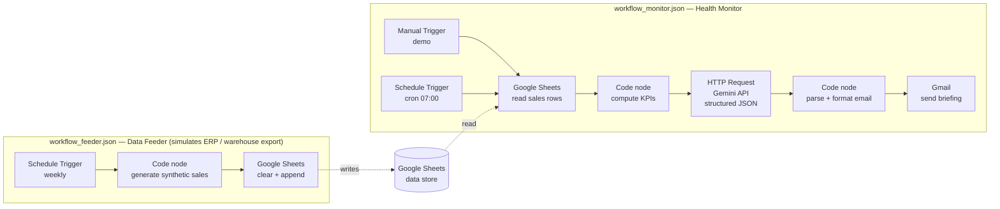

# Sales & Margin Health Monitor

An automated daily **finance briefing** for an e-commerce business, built in [n8n](https://n8n.io).
Every week it reads sales data, computes KPIs, asks an LLM to write a short management
commentary and emails it — turning raw numbers into an actionable insight before anyone opens a spreadsheet.

> **Portfolio project.** Runs on 100% synthetic data. No real company data, names, or structures are involved.

---

## Why this exists

A revenue chart alone lies by omission. Sales can grow while profitability quietly erodes —
a promotion that lifts volume but destroys margin, a supplier cost creep, a stockout hiding
in the average. This monitor pairs **revenue with margin** and surfaces the divergence in
plain language, the way a controller would flag it.

Example output (real, from the synthetic dataset):

> 🔴 **KPI Briefing: Revenue Up, Margin Down Week-over-Week**
> Revenue for 2026-07-02 was 40,586 PLN at 62.22% margin. Over the last 7 days revenue reached
> 329,113 PLN (+5.16% vs the prior week), **but margin fell 1.65 pp (61.76% → 60.11%)**. Higher
> volume did not translate into proportional profitability — worth investigating.
> **Watch:** revenue up while margin drops. **Rating:** `needs_attention`.

The drop is driven by a discount on one product line that boosts units sold but crushes unit
margin — exactly the kind of signal a raw sales report hides.

---

## Architecture



The project is split into **two workflows** to mirror a real deployment: a **source system**
that produces the data, and a **consumer** that analyses it.

- **`workflow_feeder.json` — Data Feeder** simulates a nightly/weekly ERP or warehouse export. It
  generates a fresh synthetic dataset and writes it to a Google Sheet. *In production this
  entire workflow is replaced by a real data source* (see [Production data sources](#production-data-sources)).
- **`workflow_monitor.json` — Health Monitor** reads the data, computes KPIs, asks the LLM for a
  structured commentary and emails the briefing.

**Monitor flow:** trigger → read data → compute KPIs → LLM commentary (structured output) →
format → email.

---

## How it works

1. **Trigger** — a Schedule Trigger (cron `0 7 * * *`) for production, plus a Manual Trigger
   for on-demand demos.
2. **Read data** — the Google Sheets node pulls the daily sales rows (date, SKU, product,
   category, units, price, cost, revenue, COGS, margin).
3. **Compute KPIs** — a JavaScript Code node aggregates the last day and two rolling 7-day
   windows, then derives revenue, blended margin %, week-over-week revenue change, and the
   margin change in percentage points.
4. **LLM commentary** — the KPIs are sent to the **Gemini API** via a plain HTTP Request.
   The request uses `responseSchema` (structured output) so the model returns a **predictable
   JSON object** (`headline`, `comment`, `watch_flag`, `rating`) instead of free-form text.
5. **Format** — a second Code node parses the JSON and builds an HTML email.
6. **Send** — the Gmail node delivers the briefing.

---

## Tech stack

| Layer | Tool |
|---|---|
| Orchestration | n8n |
| Data source | Google Sheets |
| Logic | JavaScript (n8n Code node) |
| LLM | Google Gemini (`gemini-2.5-flash`) via REST API |
| Delivery | Gmail |
| Synthetic data | Python (standard library only) |

---

## Design decisions & good practices

- **Structured output over free text.** The LLM is constrained by a JSON schema, so downstream
  nodes get typed, predictable fields — no brittle string parsing of prose.
- **Secrets stay out of the repo.** The Gemini API key and OAuth tokens live in n8n
  **credentials.** never in the workflow body or code. Exporting the workflow to GitHub leaks
  nothing.
- **Least privilege, isolated account.** The Google integrations run on a dedicated account
  used only for automation experiments, so the token can never touch personal or production data.
- **Safe by default.** The workflow ships **inactive** and the send step can be deactivated —
  it never fires on its own. A production version would add human-in-the-loop review before any
  irreversible action.

---

## Synthetic data

`generate_sales_data.py` produces a realistic but entirely fictional dataset: 12 apparel SKUs
across 6 categories, 120 days of daily sales, weekly seasonality, a mild trend, random noise,
and four **injected anomalies** (a margin-destroying promo, a demand spike, a stockout and a
unit-cost increase) so the monitor has something real to detect.

```bash
python generate_sales_data.py   # -> sales_data.csv
```

Import the CSV into a Google Sheet, then point the Google Sheets node at it.

---

## Repository contents

| File | Purpose |
|---|---|
| `generate_sales_data.py` | Synthetic sales-data generator (standalone Python, for reference) |
| `n8n_feeder_generate_code_node.js` | Used in `workflow_feeder.json` — Code node generating the synthetic dataset |
| `n8n_kpi_code_node.js` | Used in `workflow_monitor.json` — Code node, KPI aggregation |
| `n8n_gemini_http_body.json` | Used in `workflow_monitor.json` — HTTP Request body, Gemini call with structured output |
| `n8n_format_email_code_node.js` | Used in `workflow_monitor.json` — Code node, parse LLM response + build email |
| `workflow_feeder.json` | Exported Data Feeder workflow (import to reproduce) |
| `workflow_monitor.json` | Exported Health Monitor workflow (import to reproduce) |

> To export a workflow from n8n: open it → top-right **⋯** menu → **Download**.

---

## Production data sources

The **Data Feeder** workflow is a stand-in for a real source system. Its only job is to make
the demo run end-to-end with zero manual steps. In a real deployment you delete the feeder and
point the Monitor at one of these instead — the analysis half of the pipeline stays identical,
because the data source is a swappable detail, not the core:

| Pattern | How | When |
|---|---|---|
| **Direct SQL** | n8n connects to the database / read replica and runs a query | Cleanest; when DB access is available |
| **ERP API** | n8n HTTP Request pulls from the ERP's REST endpoint | When the ERP exposes an API |
| **File drop** | ERP/Power Query exports a file to SharePoint / Drive / S3; n8n reads it | When direct DB access is locked down (common in SMBs) |
| **Warehouse / Sheet** | A scheduled job loads a table (BigQuery, Postgres) or Sheet; n8n reads it | When you also want history / a single source of truth |

## Possible extensions

- Per-SKU anomaly detection (flag each product that breaks its own margin baseline).
- A RAG layer to "ask your financial data" in natural language.
- Slack/Telegram delivery alongside email.
- Self-hosted deployment (Docker) with the LLM swapped for a local model.

---

*Built as a portfolio piece demonstrating the intersection of financial analysis and AI
automation. All data is synthetic.*
